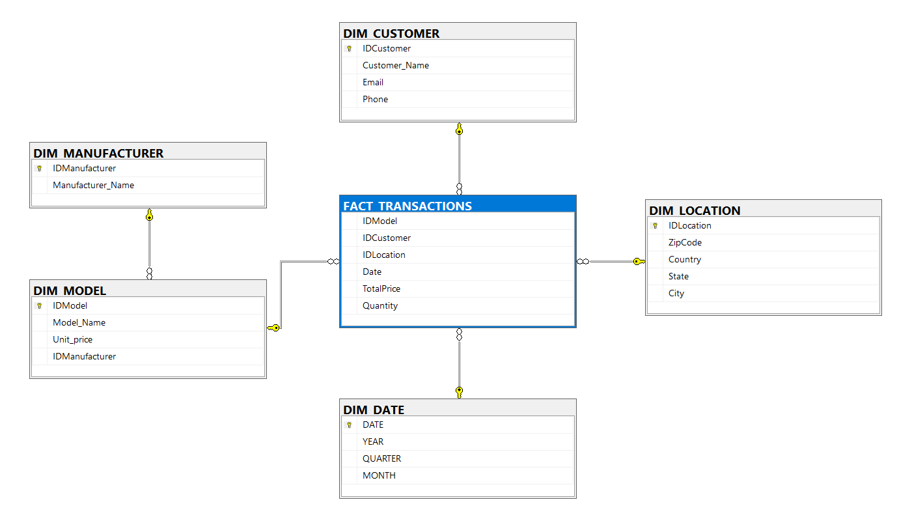

# Cellphone Sales Data Analysis

This project contains SQL queries designed to analyze cellphone sales data. The queries offer insights into various aspects of cellphone purchases, including customer demographics, sales trends, and manufacturer performance.

**Note:** To create the database for this project, please use the SQL file for Mobile Manufacture Database Creation.

### Sample Data Visualization

## Features

- **Displaying All Tables:** Retrieves and displays all the tables available in the database.
- **State-wise Customer Purchases:** Lists all the states with customers who have purchased cellphones from 2005 to the present.
- **Top Cellphone Purchasing State for Samsung:** Identifies the state in the US that has purchased the most Samsung cell phones.
- **Transaction Count by Model and Location:** Displays the number of transactions for each model, per zip code, per state.
- **Cheapest Cellphone:** Finds the cheapest cellphone and displays the price.
- **Average Price by Model for Top Manufacturers:** Calculates the average price for each model among the top 5 manufacturers by sales quantity, ordered by average price.
- **High-Spending Customers in 2009:** Lists the names of customers and the average amount spent in 2009, where the average is higher than 500.
- **Consistent Top-Selling Models (2008-2010):** Identifies any model that was in the top 5 in terms of quantity sold simultaneously in 2008, 2009, and 2010.
- **Top Manufacturers by Sales (2009 vs 2010):** Finds the manufacturer with the 2nd highest sales in 2009 and the manufacturer with the 2nd highest sales in 2010.
- **New Manufacturers in 2010:** Displays manufacturers that sold cellphones in 2010 but not in 2009.

## Usage

You can execute these SQL queries on the dataset to perform various analyses and gain insights into cellphone sales trends.

**Note:** To create the database for this project, please use the SQL file for Mobile Manufacture Database Creation.
